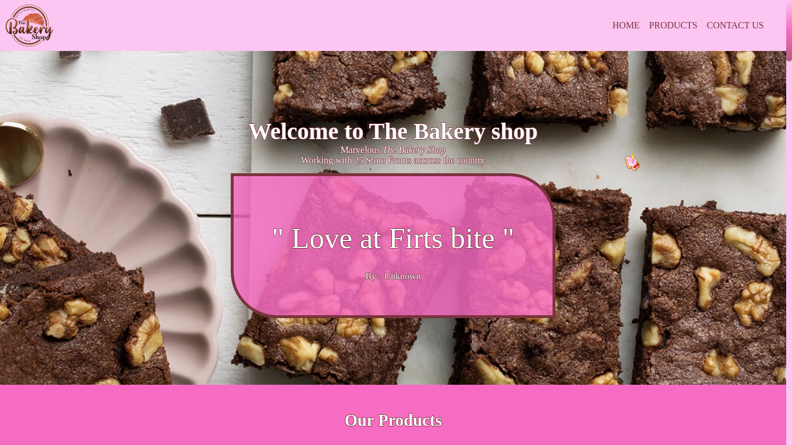
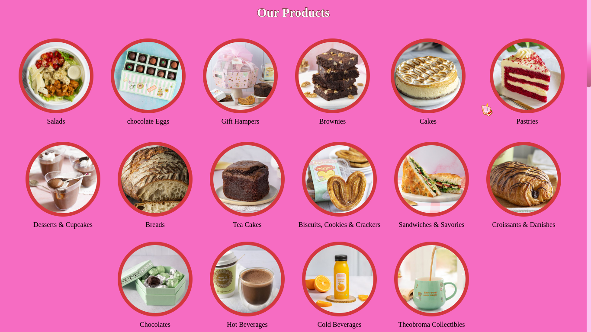

<br/>
<p align="center">
  <a href="https://github.com/NIKHIL0VERMA/TheBakeryshop">
    
  </a>

  <h3 align="center">The Bakery shop</h3>

  <p align="center">
    An Awesome Bakery Style Webpage To Jumpstart Your Shops Projects!
    <br/>
    <br/>
    <a href="https://github.com/NIKHIL0VERMA/TheBakeryshop">View Demo</a>
    .
    <a href="https://github.com/NIKHIL0VERMA/TheBakeryshop/issues">Report Bug</a>
    .
    <a href="https://github.com/NIKHIL0VERMA/TheBakeryshop/issues">Request Feature</a>
  </p>
</p>

  

## About The Project



This repo serves as the template for your brand-new bakery-type shop.

Here's why:

* Your time should be focused on creating other important aspects of the shop than creating and listing products.

Of course, no one template will serve all projects since your needs may be different. So I'll be adding more in the near future. You may also suggest changes by forking this repo and creating a pull request or opening an issue.

A list of commonly used resources that I find helpful is listed in the acknowledgments.

## Built With

Purely HTML & CSS

## Getting Started

To get this webpage running locally with your own tweaks follow the instructions below:

### Installation

1. Clone the repo

```sh
git clone https://github.com/NIKHIL0VERMA/TheBakeryshop.git
```

2. Open in IDE or Text editors

3. Tweak the HTML page

4. Open the file in the browser

## Preview




https://github.com/NIKHIL0VERMA/TheBakeryshop/assets/49404370/598958fe-0a10-4a10-b49b-a98cd0603170

## Roadmap

See the [open issues](https://github.com/NIKHIL0VERMA/TheBakeryshop/issues) for a list of proposed features (and known issues).

## Contributing

Contributions are what makes the open-source community such an amazing place to learn, inspire, and create. Any contributions you make are **greatly appreciated**.
* If you have suggestions for adding or removing projects, feel free to [open an issue](https://github.com/NIKHIL0VERMA/TheBakeryshop/issues/new) to discuss it, or directly create a pull request after you edit the *README.md* file with necessary changes.
* Please make sure you check your spelling and grammar.
* Create individual PR for each suggestion.

### Creating A Pull Request

1. Fork the Project
2. Create your Feature Branch (`git checkout -b feature/AmazingFeature`)
3. Commit your Changes (`git commit -m 'Add some AmazingFeature'`)
4. Push to the Branch (`git push origin feature/AmazingFeature`)
5. Open a Pull Request

## License

Distributed under the MIT License. See [LICENSE](https://github.com/NIKHIL0VERMA/TheBakeryshop/blob/main/LICENSE.md) for more information.

## Authors

* **Nikhil Verma** - *BTech CSE Student* - [Nikhil Verma](https://github.com/NIKHIL0VERMA/) - *Built this Template*
